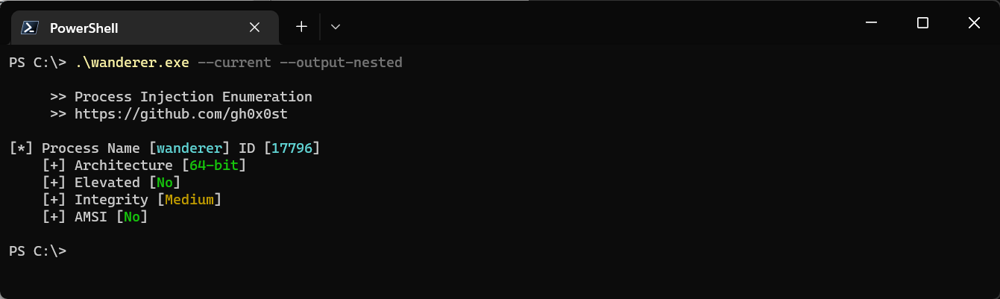
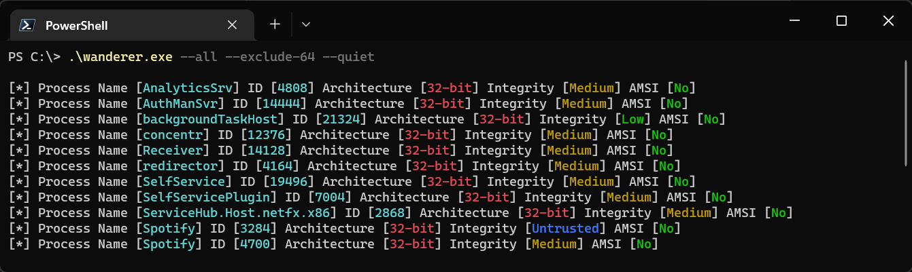
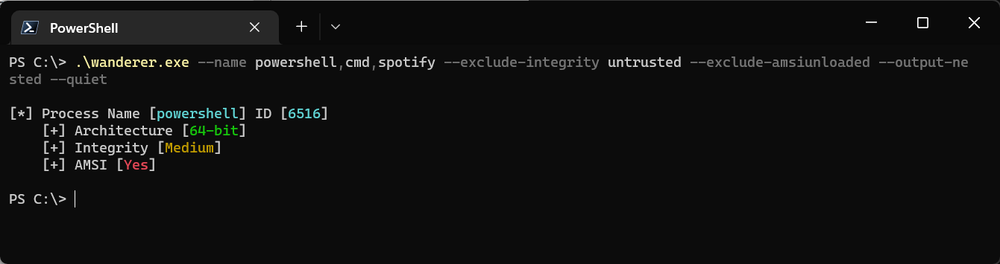
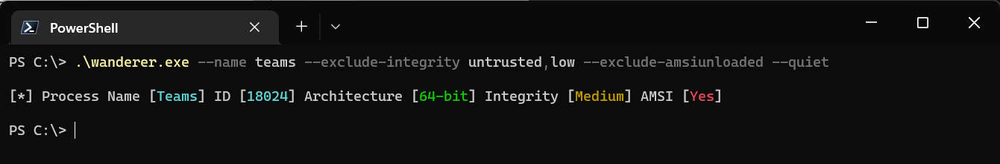
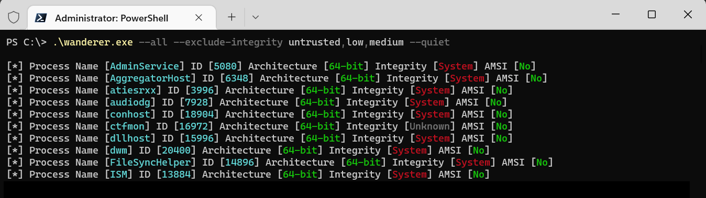

# Wanderer

Wanderer is an open-source program that collects information about running processes. This information includes the integrity level, the presence of the AMSI as a loaded module, whether it is running as 64-bit or 32-bit as well as the privilege level of the current process. This information is extremely helpful when building payloads catered to the ideal candidate for process injection.

This is a project that I started working on as I progressed through Offensive Security's PEN-300 course. One of my favorite modules from the course is the process injection & migration section which inspired me to be build a tool to help me be more efficient in during that activity. A special thanks goes out to ShadowKhan who provided valuable feedback which helped provide creative direction to make this utility visually appealing and enhanced its usability with suggested filtering capabilities. 
 
## Usage

```shell
PS C:\> .\wanderer.exe

     >> Process Injection Enumeration
     >> https://github.com/gh0x0st
     
Usage: wanderer [target options] <value> [filter options] <value> [output options] <value>

Target Options:

-i, --id, Target a single or group of processes by their id number
-n, --name, Target a single or group of processes by their name
-c, --current, Target the current process and reveal the current privilege level
-a, --all, Target every running process

Filter Options:

--include-denied, Include instances where process access is denied
--exclude-32, Exclude instances where the process architecture is 32-bit
--exclude-64, Exclude instances where the process architecture is 64-bit
--exclude-amsiloaded, Exclude instances where amsi.dll is a loaded process module
--exclude-amsiunloaded, Exclude instances where amsi is not loaded process module
--exclude-integrity, Exclude instances where the process integrity level is a specific value

Output Options:

--output-nested, Output the results in a nested style view
-q, --quiet, Do not output the banner

Examples:

Enumerate the process with id 12345
C:\> wanderer --id 12345

Enumerate all processes with the names process1 and processs2
C:\> wanderer --name process1,process2

Enumerate the current process privilege level
C:\> wanderer --current

Enumerate all 32-bit processes
C:\wanderer --all --exclude-64

Enumerate all processes where is AMSI is loaded
C:\> wanderer --all --exclude-amsiunloaded

Enumerate all processes with the names pwsh,powershell,spotify and exclude instances where the integrity level is untrusted or low and exclude 32-bit processes
C:\> wanderer --name pwsh,powershell,spotify --exclude-integrity untrusted,low --exclude-32
```

## Screenshots

### Example 1



### Example 2



### Example 3



### Example 4



### Example 5


